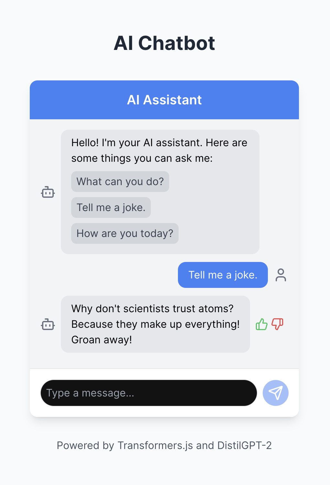

# AI Chatbot

A responsive and feature-rich AI chatbot built with **React.js**, **TensorFlow.js**, and **Universal Sentence Encoder**. This chatbot can handle queries, provide answers, and learn from user input dynamically.

## 🚀 Features

- **Dynamic AI Responses**: Generates responses based on user input.
- **Learning Capabilities**: Dynamically trains on user-provided input.
- **Interactive Feedback**: Allows users to rate responses for accuracy.
- **Typing Indicator**: Displays a "thinking" animation while generating responses.
- **Suggested Questions**: Offers initial prompts for users.
- **Responsive Design**: Optimized for both desktop and mobile.

## 🛠️ Technologies Used

- **React.js**: Frontend framework.
- **Vite**: Modern build tool for fast development.
- **TensorFlow.js**: AI/ML processing in the browser.
- **Universal Sentence Encoder**: Lightweight language model for text similarity.
- **Tailwind CSS**: For elegant and responsive UI.
- **Lucide Icons**: Stylish icons for user interface.

## 🖼️ Project Preview

Here’s a sneak peek of the AI Chatbot:


## 📦 Installation

### 1. Clone the repository

```bash
git clone https://github.com/yourusername/ai-chatbot.git
cd ai-chatbot
```

### 2. Install dependencies:

```bash
npm install
```

### 3. Start the development server:

```bash
npm run dev
```

### 4. Build for production

```bash
npm run build
```

### 🛡️ Project Structure:

```bash
ai-chatbot/
├── public/             # Static assets (images, favicon, etc.)
├── src/                # Source code
│   ├── components/     # Reusable React components
│   ├── content/        # ResponseGenerator.js for AI responses
│   ├── App.jsx         # Main app component
│   ├── index.css       # Global styles
│   ├── main.jsx        # Entry point
├── vite.config.js      # Vite configuration
├── package.json        # Project dependencies and scripts
└── README.md           # Project documentation
```



### 👩‍💻 Contributing:

Contributions are welcome! If you have ideas to improve the chatbot or encounter any issues, feel free to open a pull request or issue.

### 🌟 Acknowledgements:

TensorFlow.js for enabling AI in the browser.
Vite for making the development workflow fast and smooth.
Lucide Icons for the elegant icons.

### 📄 License:

This project is licensed under the MIT License. Feel free to use, modify, and distribute as needed.
